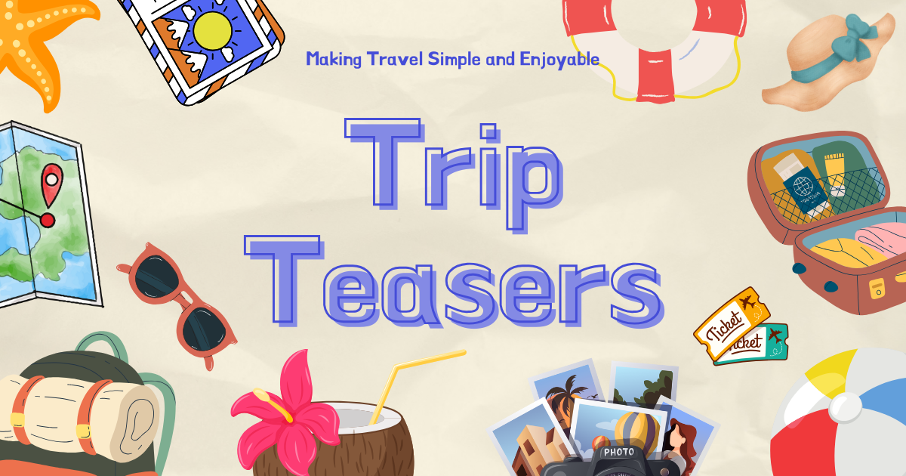
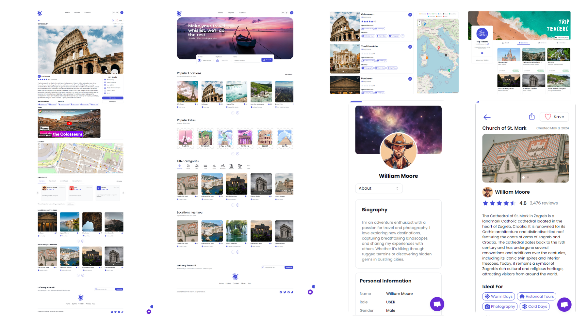
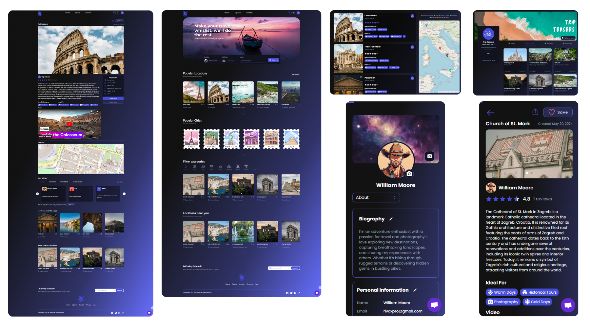

<div align="center">


<h3 align="center">Trip Teasers (travel web app)</h3>

</div>

## 🛠️ Tech Stack


## 🧩 Features

- **Authentication**: User authentication is implemented using **Next-auth v5** with Next.js server actions. It includes token generation for verification and 2FA login options. Emails are sent via the **Resend** service.
- **User Profile**: Users can add/edit profile and cover images, as well as other profile details such as biography, social media links, date of birth, and more.
- **Other Profiles**: View other users' profiles, including their reviews of various locations, added locations, and favorite locations.
- **Adding new locations**: Users can add their favorite locations by filling out a multistep form. Up to 8 photos can be uploaded, each with a maximum size of 4MB, using the **uploadthing** service.
- **Form Validation**: Secure validation for all forms is implemented using **zod**.
- **Adding Reviews and Favorites Locations**: Users can add one review per location, which can later be edited or deleted. Locations can also be added to favorites.
- **Light and Dark mode**: Designed to support both light and dark modes based on user preferences.
- **Different Filter/Search variants**: Users can search for locations by country, city, or name and filter by category.
- **Location of place on Map**: The map displays all locations based on country, city filters, or specific searches, and also shows details of each location.
- **Responsive design**: The entire site is responsive for all devices using **Tailwind CSS** with **shadcn/UI**.

## 💾 Start Guide

**Cloning Repository**

```bash
git clone https://github.com/Bozos2/tourist-app.git
```

**Installation**

Install project dependencies:

```bash
 npm install
```

**Environment Variables**

```env
DATABASE_URL=

AUTH_SECRET=

# OAuth keys
GOOGLE_CLIENT_ID=
GOOGLE_CLIENT_SECRET=

TWITTER_CLIENT_ID=
TWITTER_CLIENT_SECRET=

DISCORD_CLIENT_ID=
DISCORD_CLIENT_SECRET=

RESEND_API_KEY=

NEXT_PUBLIC_APP_URL=

# For resend service
EMAIL=

UPLOADTHING_SECRET=
UPLOADTHING_APP_ID=
```

## 🖼️ Images

**Light mode**



**Dark mode**


